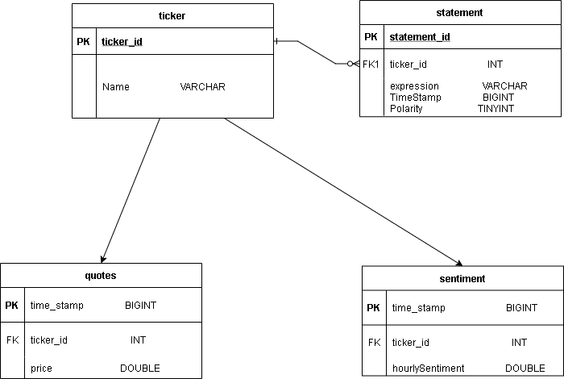

[](https://github.com/jonreesman/watch-dog/actions/workflows/go.yml)
[](https://www.codefactor.io/repository/github/jonreesman/watch-dog)
# watch-dog
The purpose of this project is to scrape twitter, reddit, and various news sources on an hourly basis in order to provide the user with a regular sentiment analysis for their chosen stock/crypto tickers. It will feature a frontend, built with React, that will chart stock prices vs their hourly sentiment on Twitter. As new stocks/cryptos are added, they will be cached in the database to reduce the API calls to Twitter. As the program detects headlines that are considered popular for a given stock/crypto (eg, elevated volume of retweeting the article), it will incorporate these headlines into the graph as well.

While I do not believe this project will give the user a leg up in terms of day-trading, I do think it possesses value as a market research tool. Some stocks and crypto have a low volume of tweets, making it difficult to glean any time-sensitive, useful data. But being able to graph sentiment over time and correlate it with the price has been a large desire of mine, because I do think there is value there. In it's most simple form, it may be able to help the user detect potential pump and dumps, which is why I named it watch-dog.

This is a very early build, that presently can scrape twitter and provide a sentiment from its extracted tweets and print it to stdout. I have experimented with multiple different databases (DynamoDB, MongoDB) but have ultimately settled on MySQL via Google Cloud.

The watch-dog project is my first for Go, so it is a learning curve for me.

## To Do:
- [ ] Train new sentiment analysis model
      - [ ] Filter tweets by language
      - [ ] Filter out spam tweets
- [ ] Implement a Web UI (REACT)
- [ ] Incorporate relevant news scraping

## Complete
- [x] Cloud SQL Integration
   - [x] Input sanitation
   - [x] Push integration
   - [x] Pull integration
- [x] Collect a large data set of tweets, reddit comments, news sources to use to more applicably train the present sentiment analysis model.

## No longer utilizing
- [x] MongoDB Integration
   - [x] MongoDB Graphing

## Structure

### main.go: Creates a Bot instance and spins it up utilizing a Bot reciever function.

### bot.go: Implements the business logic of the Bot type.

### types.go: Defines the different objects used throughout the project.
  
  ticker - Stores the name of the stock/crypto ticker, the time of the last web scraping, all the tweets for that ticker, and the hourly sentiment.
  
  statement - Stores the data for each tweet (defined here as "expression" for flexibility when reddit and news scraping is implemented). It will also be flexible and store reddit comments and news articles. It also stores the polarity of the expression.
  
  bot - Stores our slice of tickers, as well as the time interval in which scraping will be conducted (for flexibility while debugging, you can reduce the interval from hourly to your own short interval).
  
### ticker.go: Handles the business logic of the ticker type.

```computeHourlySentiment() float64```

      Returns the average sentiment (defined as polarity) of all tweets currently stored for the specific ticker.
      
```pushToDb()```

      Presently, this is a DynamoDb specific function. Makes calls to db.go to push the tweets of the specific ticker to your DynamoDb table.
  
```printTicker()```
      
      Primarily a debug function, but it prints out the name of the ticker, the number of tweets presently stored, the time of the last scrape, and all the tweets it currently has.
  
```importTickers() []ticker```
      
      Basic IO function that takes your chosen tickers from the "tickers.txt" file. Returns a slice of ticker objects, one for each stock/crypto ticker.
      
```scrapeAll(t \*[]ticker)```
      
      Handles the slice of Tickers (imported by importTickers()), and calls the scrape receiver function for each ticker.
  
```scrape()```
      
      Receiver function for individual ticker objects. Makes calls to twitter.go to scrape and store tweets in the tickers object.
      
### twitter.go: Handles the business logic of calling the twitterscraper package (github.com/n0madic/twitter-scraper).
  
```twitterScraper(n string) []statement```
      
      Takes the name of the ticker (eg: SPY, TSLA, VOO, etc), and makes calls to the twitterscraper package to scrape the tweets. It then builds the statement object and returns it to the scrape() ticker receiver function.
      
### sentiment.go: Utilizes the sentiment package (github.com/cdipaolo/sentiment) to run sentiment analysis on the tweet it is passed.
  
```polarity(tweet string) uint8```
      
      Takes the tweet as a string, runs sentiment analysis, and returns the polarity (0: negative, 1: positive) representing the tweets sentiment on the ticker.


## Database Scheme
Below is the proposed Database Scheme being employed in MySQL.


